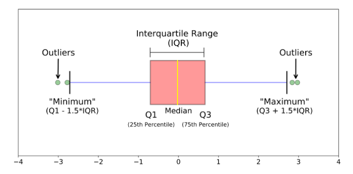

```{r setup, include=FALSE}
knitr::opts_chunk$set(echo = TRUE,
                      fig.align = "center",
                      dpi = 300,
                      fig.retina = 2,
                      warning = FALSE,
                      message = FALSE)
```

```{r packages}
library(here)
library(ggplot2)
library(patchwork)
```


# Domande

## Ricodificare variabile

Quando abbaimo un dataframe spesso è utile ricodificare i valori di una colonna in base ad alcune condizioni logiche. Ad esempio, ricodificare l'età in base alla fascia (e.g. maggiore e minore di 18). Per fare questo ci sono diverse funzioni e approcchi:

### `ifelse()`

La funzione `ifelse()` permette di eseguire del codice in modo **condizionale** ovvero in funzione ad una condione logica che quindi restituisce valori `TRUE` e `FALSE`.

Generiamo delle età casuali:

```{r}
age <- round(runif(30, 15, 70))
age
```

Ora vogliamo creare un vettore di lunghezza `r length(age)` con la stringa "minorenne" se il valore di `age` è minore di 18 anni e maggiorenne se il valore è maggiore o uguale a 18:

```{r}
# test = condizione da testare
# yes = cosa deve succedere se test è TRUE
# no = cosa deve succedere se test è FALSE

ifelse(test = age < 18, yes = "minorenne", no = "maggiorenne")
```

Se vogliamo più di una condizione possiamo usare più `ifelse()`, uno dentro l'altro:

```{r}
ifelse(age < 18,
       yes = "minorenne",
       no = ifelse(age > 18 & age < 60, 
                   yes = "adulto", 
                   no = "anziano"))
```

### `case_when()`

Questa funzione può essere utile quando abbiamo tante condizioni. Indicativamente con più di 3 condizioni scrivere tanti `ifelse()` può essere scomodo. In questo caso possiamo usare la funzione `case_when()` dal pacchetto `dplyr`. La sintassi è strana ma molto intuitiva: `test ~ valore` e possiamo mettere più `test` chiaramente separati da una virgola

```{r}
dplyr::case_when(
    age < 18 ~ "minorenne",
    age >= 18 & age < 60 ~ "adulto",
    age >= 60 ~ "anziano"
    # ...altre condizioni
)
```

# Esercizi

## 1.12

Leggiamo i dati:

```{r}
dat <- readxl::read_xls(path = here("didattica-2022/data/pazienti.xls"))
```

Vediamo i quartili:

```{r}
# con summary ci vengono già calcolati
summary(dat$ansia)
```

Il 2 quartile è in realtà la mediana, quindi possiamo calcolarlo con la funzione `median()`:

```{r}
median(dat$ansia) # 2 quartile
```

Il modo più generale e versatile però è usare la funzione `quantile()` che permette di ottenere qualsiasi quantile e non solo i quartili. Otteniamo il 25, 50 e 75 percentile ovvero il primo, secondo e terzo quartile:

```{r}
quantile(dat$ansia, probs = c(0.25, 0.5, 0.75))
```

Possiamo ottenere i quantili anche per variabili ordinali. Prima però dobbiamo dire ad R che le etichette della variabile sono in realtà in ordine:

```{r}
# fattore normale
factor(dat$cl.sociale)

# fattore ordinato
ordered(dat$cl.sociale, levels = c("Bassa", "Media", "Alta"))

# fattore ordinato usando il comando factor
factor(dat$cl.sociale,
       levels = c("Bassa", "Media", "Alta"),
       ordered = TRUE)
```

Per ottenere i quantili poi dobbiamo cambiare il tipo di algoritmo, in particolare il `type = 1`:

```{r}
cl_sociale_ord <- ordered(dat$cl.sociale, levels = c("Bassa", "Media", "Alta"))

quantile(cl_sociale_ord, probs = c(0.25, 0.5, 0.75), type = 1)
```

Ogni volta che avete un dubbio, leggete la documentazione delle funzioni R ed i messaggi di errore/warning. In questo caso sono molto utili per capire cosa dobbiamo fare:

```{r, error=TRUE}
# fattore non ordinato
cl_sociale_fac <- factor(dat$cl.sociale)
quantile(cl_sociale_fac, probs = c(0.25, 0.5, 0.75))
```

Il rango percentile invece è la percentuale di valori minori o uguali ad un dato valore $x_i$. Quindi può essere visto come "speculare" al percentile. Facciamo un esempio con la mediana:

- il rango percentile della mediana è 50% (o 0.5)
- mentre il valore associato al 50% rango percentile è la mediana

Con la funzione `quantile()` noi chiediamo quale valore è associato ad un certo rango percentile (argomento `probs = `) mentre se calcoliamo manualmente la quantità di valori uguali o inferiori ad un dato valore allora stiamo calcolando il rango percentile.

Ad esempio, calcoliamo il rango percentile di 39 (magari ci sono funzioni che lo fanno già direttamente):

```{r}
sort(dat$eta) # ordinare
mean(sort(dat$eta) <= 39)
```

Lo stesso principio si può usare con distribuzioni teoriche le quali sono già implementate in R. Tutte le distribuzioni disponibili hanno le funzioni `d`, `p`, `q`, `r` che permettono di calcolare o generare dati. Ad esempio:

```{r}
curve(dnorm(x, mean = 0, sd = 1), -4, 4)
```

il rango percentile (la percentuale/probabilità cumulata) si calcola con il comando `p`. Nel caso della normale:

```{r}
# q = quantile su cui calcolare il rango percentile
# mean = media della distribuzione normale
# sd = deviazione standard della distribuzione normale

pnorm(q = 0, mean = 0, sd = 1)
```

il quantile associato ad un certo rango percentile si calcola con il comando `q`:

```{r}
# p = probabilità comulata associata ad un certo quantile (aka rango percentile)
# mean = media della distribuzione normale
# sd = deviazione standard della distribuzione normale

qnorm(p = 0.5, mean = 0, sd = 1)
```

### Varianza, devianza e deviazione standard

La varianza e la deviazione standard sono 2 indici di dispersione molto utilizzati perchè indicano quanto i valori di una distribuzione di dati sono dispersi rispetto alla media.

Per capire è utile scomporre le formule. La devianza $SS$ è la somma degli scarti alla media. Gli scarti sono le differenze di ogni valore della distribuzione dalla sua media (si utilizza $n - 1$ quando si stima la varianza campionaria mentre solo $n$ per la varianza della popolazione) 

$$
SS = \sum_{i = 1}^n (x_i - \bar x)^2
$$

La varianza $\sigma^2$ è la media degli scarti dalla media. Quindi è semplicemente la devianza divisa per il numero di elementi:

$$
\sigma^2 = \frac{\sum_{i = 1}^n (x_i - \bar x)^2}{n - 1} = \frac{SS}{n-1}
$$
La deviazione standard infine non è altro che la radice quadrata della varianza.

In R possiamo calcolarle con le funzioni `var()` e `sd()` e la devianza semplicemente adattando la formula:

```{r}
# devianza. somma degli scarti dalla media al quadrata
SS <- sum((dat$eta - mean(dat$eta))^2)
SS

# varianza 
SS / (length(dat$eta) - 1)
var(dat$eta)

# deviazione standard
sqrt(SS / (length(dat$eta) - 1))
sd(dat$eta)
```

### Moda

La **moda** invece è l'elemento/i di una distribuzione associato/i alla frequenza massima. Al contrario di media e mediana ci possono essere più mode. In questo caso la distribuzione viene definita multimodale.

Vediamo la distribuzione:

```{r}
barplot(table(dat$eta)) # visualizziamo le 4 mode
```

Vediamo se corrispondono:

```{r}
ADati::moda(dat$cl.sociale)
ADati::moda(dat$eta)
```

### Boxplot

Il boxplot è una delle rappresentazioni grafiche più semplici ma potenti che ci siano. Fornisce tante informazioni su una distribuzione di valori numerici come:

- i quartili
- lo scarto interquartile ($IRQ$)
- eventuali outlier

```{r, fig.cap="Elementi principali di un Boxplot. Fonte https://towardsdatascience.com/understanding-boxplots-5e2df7bcbd51", out.width="100%", echo = FALSE}

```

La scatola contiene il 50% della distribuzione (ovvero la differenza tra il 3° e il 2° quartile). La linea all'interno della scatola è la mediana mentre i due estremi sono il "minimo" ed il "massimo" intesi però come $1.5\;IRQ$ ovvero una volta e mezza lo scarto interquartile. Gli outlier sono quindi valori che sono più grandi o più piccoli di una volta e mezza lo scarto interquartile.

Possiamo crearlo con il comando `boxplot()`:

```{r}
boxplot(dat$ansia)
```

Un trucco per capire intuitivamente il boxplot è immaginarlo come un istogramma dall'alto. Infatti come l'istogramma ci da un'idea della forma della distribuzione ma con molte più informazioni:

```{r}
histp <- ggplot(dat) +
    geom_histogram(aes(x = ansia),
                   bins = 30,
                   fill = "lightblue", 
                   col = "black")
boxp <- ggplot(dat) +
    geom_boxplot(aes(x = ansia),
                 fill = "lightblue", 
                 col = "black")
boxp / histp # patchwork
```
